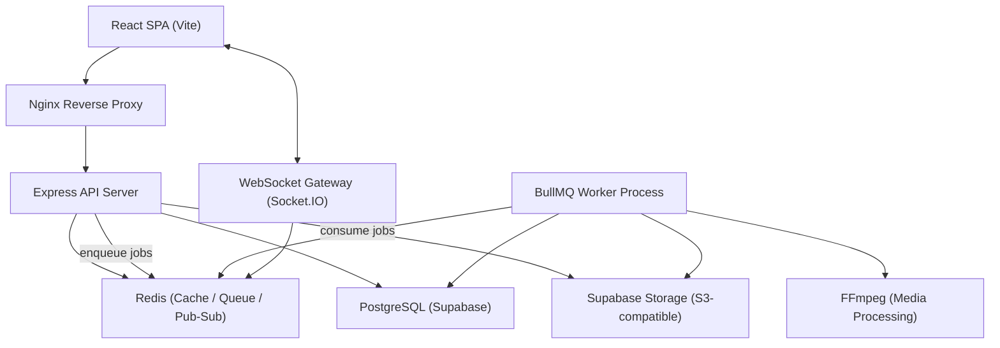
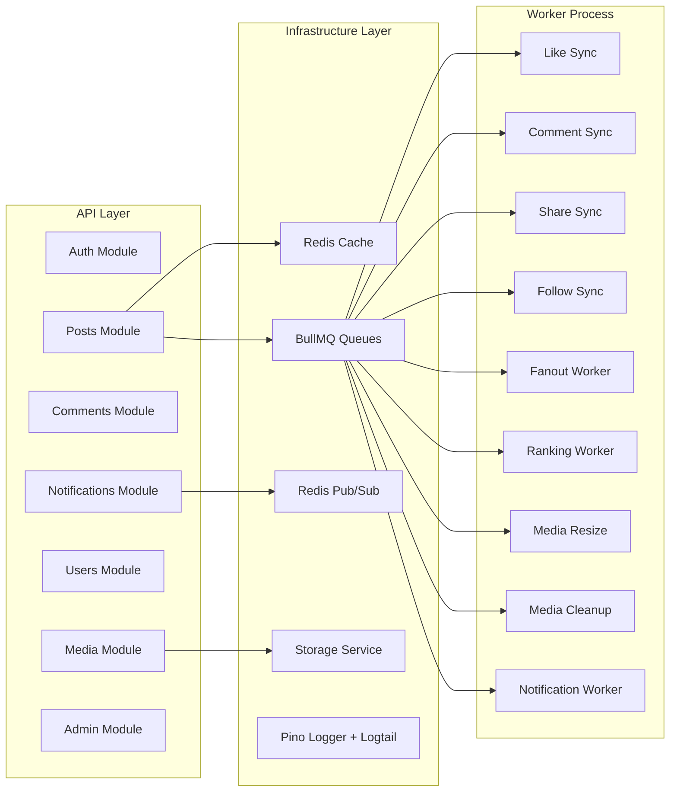
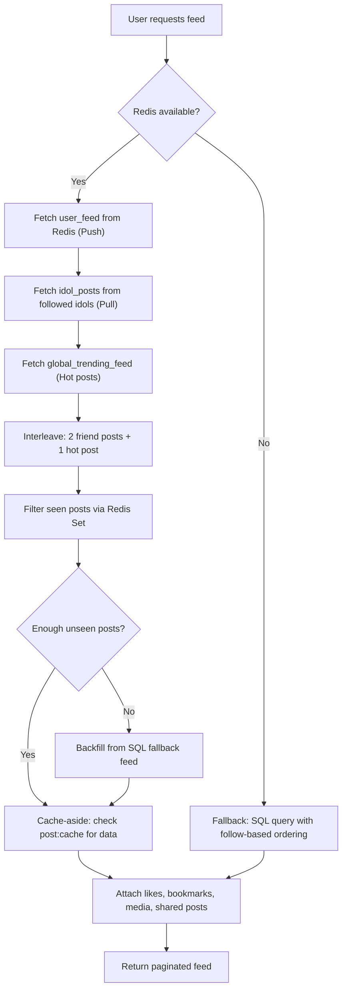
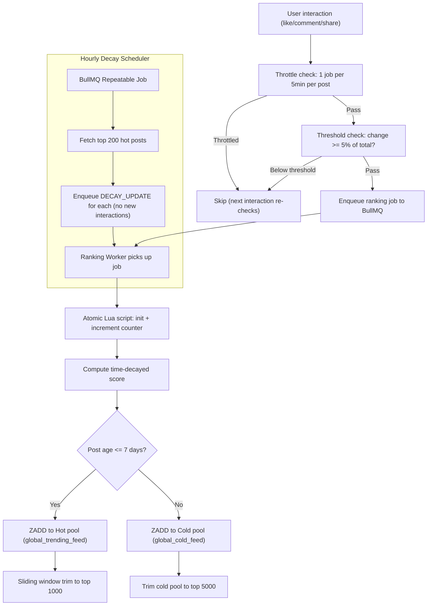
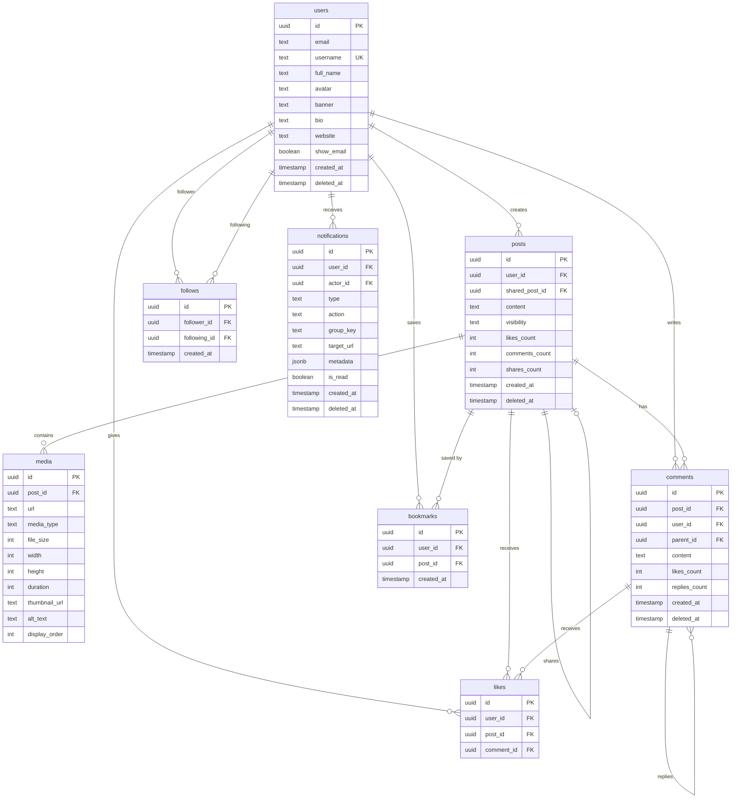
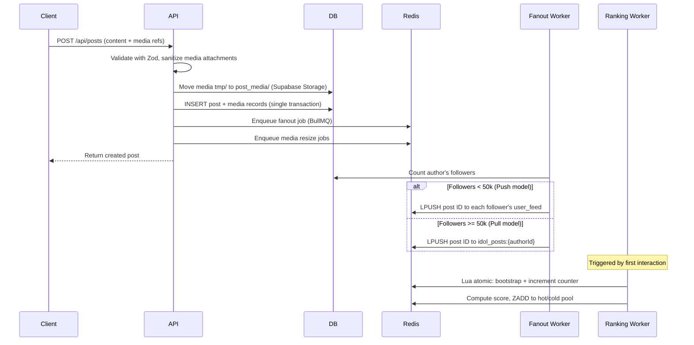
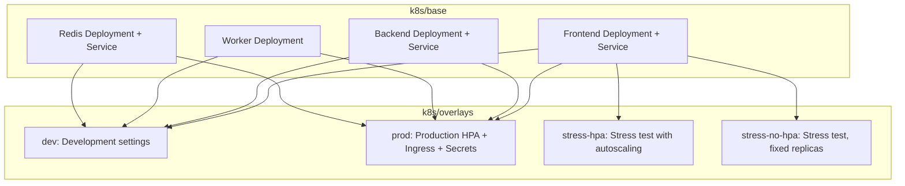

# Social Media Platform

A full-stack, production-grade social media platform built with a modern microservices-oriented architecture. The system features a **hybrid push/pull feed engine**, **time-decayed trending ranking**, **real-time notifications via WebSocket**, and a complete **media processing pipeline** -- all orchestrated through Kubernetes with GitOps-style configuration management.

---

## Table of Contents

- [System Architecture](#system-architecture)
- [Tech Stack](#tech-stack)
- [Key Features](#key-features)
  - [Hybrid Feed Engine](#1-hybrid-feed-engine-pushpull-model)
  - [Trending Ranking Algorithm](#2-trending-ranking-algorithm)
  - [Media Processing Pipeline](#3-media-processing-pipeline)
  - [Real-time Notification System](#4-real-time-notification-system)
  - [Distributed Rate Limiting](#5-distributed-rate-limiting)
  - [Authentication and Security](#6-authentication-and-security)
  - [Structured Logging and Observability](#7-structured-logging-and-observability)
  - [Graceful Degradation](#8-graceful-degradation)
- [Data Architecture](#data-architecture)
- [Feed Algorithm Deep Dive](#feed-algorithm-deep-dive)
- [Kubernetes Deployment](#kubernetes-deployment)
- [Project Structure](#project-structure)
- [Getting Started](#getting-started)

---

## System Architecture

### High-Level Overview



### Service Communication



---

## Tech Stack

| Layer | Technology |
|---|---|
| Frontend | React 19, Vite 7, TailwindCSS, React Router 7, Socket.IO Client |
| Backend | Node.js, Express 5, Drizzle ORM, Zod validation |
| Database | PostgreSQL via Supabase, Drizzle schema migrations |
| Cache / Queue | Redis 7, BullMQ (9 dedicated queues), ioredis |
| Real-time | Socket.IO with Redis Adapter (multi-pod broadcast) |
| Media | FFmpeg/FFprobe for resize, thumbnail generation, video probing |
| Storage | Supabase Storage (S3-compatible object store) |
| Auth | Supabase Auth, JWT (JWKS verification via `jose`), token blacklisting |
| Observability | Pino structured logging, pino-roll (file rotation), Logtail (cloud), distributed tracing |
| Containerization | Docker, Docker Compose (dev/prod) |
| Orchestration | Kubernetes (Minikube), Kustomize overlays (dev/prod/stress) |
| Testing | Vitest, Supertest, React Testing Library, V8 coverage |

---

## Key Features

### 1. Hybrid Feed Engine (Push/Pull Model)

The feed system uses a **hybrid fan-out architecture** that adapts its delivery strategy based on user follower count:

- **Push model** (regular users, < 50k followers): When a user publishes a post, a background worker pushes the post ID into each follower's personal Redis feed list (`user_feed:{userId}`).
- **Pull model** (high-follower "idol" users, >= 50k followers): Posts are stored in a per-idol list (`idol_posts:{userId}`). Followers pull from this list at read time, avoiding the write amplification of fan-out to millions.
- **Interleave mixing**: Friend posts and trending posts are interleaved in a 2:1 ratio to balance relevance with discovery.
- **Seen-post deduplication**: Redis Sets track which posts a user has already viewed, with a 7-day TTL auto-expiry.
- **Cache-aside pattern**: Post data is cached in Redis with TTL + random jitter to prevent cache stampede.
- **Multi-level fallback**: If Redis is unavailable, the system falls back to a pure SQL-based feed with followed-user prioritization.



### 2. Trending Ranking Algorithm

A **time-decayed scoring system** powers the global trending feed, inspired by Hacker News and Reddit's ranking formulas:

**Score formula:**
```
Score = (WeightedInteractions + CMS_Bonus) / (HoursAge + 2) ^ DecayFactor
```

- **Interaction weights**: Click (1), Like (2), Unlike (-2), Comment (3), Share (4)
- **Decay factor**: 1.8 (configurable) -- aggressively deprioritizes old content
- **CMS bonus**: A base score boost (default: 10) to prevent division-by-zero edge cases
- **Two-tier filtering**: A 5% threshold filter ignores insignificant interactions on established posts; a 5-minute throttle prevents burst recalculations

**Score tiers:**
| Tier | Score Range | Description |
|---|---|---|
| Viral | >= 15 | Extremely hot, viral within the first 1-2 hours |
| Hot | 5 - 15 | Trending, strong engagement while still recent |
| Warm | 1 - 5 | Active, steady engagement |
| Normal | 0.2 - 1 | Standard post in circulation |
| Cooling | 0.05 - 0.2 | Losing momentum, about to exit hot pool |
| Cold | < 0.05 | Expired ranking lifecycle, moved to cold archive |



### 3. Media Processing Pipeline

A robust, **asynchronous media pipeline** handles upload, validation, storage, and multi-resolution variant generation:

- **Two-phase upload**: Files are uploaded to a temporary bucket first, then atomically moved to permanent storage upon post creation
- **Multi-resolution variants**: Images are processed into 3 sizes (480px, 960px, 1440px) via FFmpeg
- **Video thumbnails**: Automatically extracted at the 0.5-second mark
- **Background processing**: All resize/thumbnail work is dispatched to BullMQ workers to keep API response times fast
- **Orphan cleanup**: A scheduled worker purges temporary uploads older than 3 hours

```mermaid
flowchart LR
    A["Client uploads file"] --> B["POST /api/media/upload"]
    B --> C["Validate: format, MIME type, size"]
    C --> D["Upload to tmp/ bucket"]
    D --> E["Return temporary URL + metadata"]
    E --> F["Client creates post with media refs"]
    F --> G["Move files: tmp/ to post_media/"]
    G --> H["Insert media records in DB (transaction)"]
    H --> I["Enqueue resize jobs to BullMQ"]
    I --> J["Media Resize Worker"]
    J --> K["FFmpeg: create 480px, 960px, 1440px variants"]
    J --> L["FFmpeg: extract video thumbnail"]
    K --> M["Upload variants to post_media_variants/ bucket"]
    L --> M
    M --> N["Update media record with thumbnail URL + dimensions"]
```



### 4. Real-time Notification System

Notifications are delivered through a **multi-layered pipeline** combining Redis buffering, BullMQ processing, WebSocket delivery, and database persistence:

- **3-second deduplication window** via Redis to prevent rapid-action spam
- **Redis buffer** (`notification_buffer` list) batches incoming notifications before processing
- **Background worker** persists notifications to PostgreSQL and emits via Socket.IO
- **Notification grouping** by `group_key` (e.g., "5 people liked your post")
- **Redis-cached unread count** with DB fallback for accuracy
- **WebSocket broadcast** via Redis Adapter for multi-pod delivery

Notification types: `LIKE`, `COMMENT`, `SHARE`, `FOLLOW`

### 5. Distributed Rate Limiting

Three-tier, Redis-backed rate limiting using sliding window counters:

| Tier | Window | Max Requests | Purpose |
|---|---|---|---|
| Global API | 5 minutes | 300 | General API protection |
| Auth | 15 minutes | 15 | Brute-force login prevention |
| Media Upload | 15 minutes | 20 | Upload abuse prevention |

- Uses `rate-limit-redis` for distributed counting across multiple API pods
- Automatic fallback to in-memory store if Redis is unavailable
- Thresholds are externalized via Kubernetes ConfigMaps for zero-downtime tuning
- Kubernetes health probes (`/health`) are excluded from rate limiting

### 6. Authentication and Security

- **Supabase Auth** with JWKS-based JWT verification (`jose` library, ES256 algorithm)
- **Token blacklisting** via Redis for immediate session revocation on logout
- **Global error interceptor** that sanitizes all 500-level responses before reaching the client, preventing stack trace or internal detail leaks
- **Input validation** using Zod schemas on all API endpoints
- **DOMPurify** on the frontend for XSS protection in user-generated content
- **Post visibility controls**: Public, Friends-only (mutual follows), and Private

### 7. Structured Logging and Observability

- **Pino** structured JSON logging with automatic PII redaction (`authorization`, `cookie` headers)
- **Distributed tracing**: `AsyncLocalStorage`-based `traceId` propagated through every request via `x-correlation-id` header
- **Multi-transport output**: Console (pino-pretty in dev), rotating log files (pino-roll: 10MB/daily rotation), and Logtail cloud
- **Silent mode** in test environments to keep test output clean

### 8. Graceful Degradation

The system is designed to remain functional even when Redis is completely unavailable:

- **Feed**: Falls back from hybrid Redis feed to SQL-based queries
- **Likes**: Redis is the write-ahead layer; BullMQ workers sync to PostgreSQL
- **Rate limiting**: Degrades to per-instance memory store
- **Notifications**: Falls back from Redis buffer to direct BullMQ queue dispatch
- **WebSocket**: Falls back from Redis Adapter to single-instance memory adapter
- **Ranking**: Skips trending feed enrichment; posts appear in chronological order
- **Presence tracking**: Disabled entirely (non-critical feature)

All degradation paths log warnings for operational visibility without crashing the process.

---

## Data Architecture



---

## Feed Algorithm Deep Dive

### Redis Key Design

| Key Pattern | Type | Purpose | TTL |
|---|---|---|---|
| `user_feed:{userId}` | List | Personal feed (push model) | Trimmed to 1000 entries |
| `idol_posts:{userId}` | List | High-follower user's post list (pull model) | Trimmed to 1000 entries |
| `global_trending_feed` | Sorted Set | Hot trending posts by score | Sliding window, max 1000 |
| `global_cold_feed` | Sorted Set | Archived trending posts | Max 5000 |
| `post:{postId}:likes` | Set | Users who liked a post | -- |
| `post:cache:{postId}` | String (JSON) | Cached post data | 300s + 0-60s jitter |
| `user:seen:{userId}` | Set | Posts already viewed | 7 days |
| `post:{postId}:interactions:total` | String (int) | Weighted interaction counter | 60 days |
| `lock:ranking:{postId}` | String | Throttle lock for ranking jobs | 5 minutes |
| `user:online:{userId}` | String | Online presence indicator | 60 seconds |
| `notification_buffer` | List | Pending notification queue | -- |
| `notif:dedupe:{...}` | String | Notification deduplication | 3 seconds |
| `rate-limit:{tier}:{ip}` | String | Rate limit counters | Varies by tier |

### Write Path: What Happens When a User Creates a Post



---

## Kubernetes Deployment

The project uses **Kustomize** for GitOps-style environment management with a shared base and per-environment overlays.



**Production overlay** includes:
- Horizontal Pod Autoscaler (HPA) for backend
- Nginx Ingress with path-based routing (`/api/` to backend, `/socket.io/` to WebSocket, `/` to frontend)
- Externalized ConfigMaps for rate limit thresholds, cache TTLs, and ranking parameters
- Sealed Secrets for database credentials and API keys

---

## Project Structure

```
SocialMediaProject/
├── social-backend/
│   ├── app.js                     # Express app setup, middleware chain
│   ├── server.js                  # HTTP server + WebSocket bootstrap
│   ├── modules/
│   │   ├── auth/                  # Login, register, JWT, Supabase integration
│   │   ├── posts/                 # CRUD, feed engine, likes, shares, bookmarks
│   │   ├── comments/              # Threaded comments with replies, like/unlike
│   │   ├── media/                 # Upload, finalize, resize, variant generation
│   │   ├── users/                 # Profile, follow/unfollow, search, relationship
│   │   ├── notifications/         # Dispatch, read/unread, grouping
│   │   ├── admin/                 # Trending dashboard, score tier analytics
│   │   ├── db/                    # Drizzle ORM config + schema definitions
│   │   └── zod/                   # Request validation schemas
│   ├── middlewares/
│   │   ├── jwt/                   # Supabase JWKS verification + token blacklist
│   │   ├── rateLimit/             # 3-tier distributed rate limiting
│   │   └── posts/                 # Post-specific middleware
│   └── infra/
│       ├── redis/                 # Redis client, hybrid persistence, service layer
│       ├── queue/                 # 9 BullMQ queue definitions + ranking throttle
│       ├── workers/               # Background job processors (9 workers)
│       │   ├── posts/             # Like sync, comment sync, share sync, fanout
│       │   ├── ranking/           # Score computation, decay scheduler
│       │   ├── media/             # Image resize, video thumbnail, cleanup
│       │   ├── notifications/     # Batch insert, WebSocket emit
│       │   └── users/             # Follow sync
│       ├── websocket/             # Socket.IO server + Redis Adapter + presence
│       ├── storage/               # Supabase Storage abstraction layer
│       ├── media/                 # FFmpeg service (probe, resize, thumbnail)
│       └── logger/                # Pino + tracing + Logtail transport
│
├── social-frontend/
│   └── src/
│       ├── pages/                 # Home, Profile, Search, Notifications, Admin, Auth
│       ├── components/            # PostCard, Feed, CommentSection, TwitterLayout
│       ├── hooks/                 # useComments, useCreatePost, useNotifications, etc.
│       ├── services/              # API client, auth, posts, comments, media, profile
│       └── lib/                   # Supabase client config
│
├── k8s/
│   ├── base/                      # Shared Kubernetes manifests
│   └── overlays/                  # dev, prod, stress-hpa, stress-no-hpa
│
├── supabase/
│   └── migrations/                # SQL migrations (UUIDv7, schema, notifications)
│
├── docker-compose.dev.yaml        # Local dev: backend + worker + redis + frontend
└── docker-compose.prod.yaml       # Production compose
```

---

## Getting Started

### Prerequisites

- Node.js >= 20
- Docker and Docker Compose
- Supabase CLI (for local database)
- Redis 7+ (or use Docker)
- FFmpeg (optional, for media processing)

### Local Development

```bash
# 1. Start Supabase locally
supabase start

# 2. Start all services with Docker Compose
docker compose -f docker-compose.dev.yaml up --build

# 3. Or run services individually:

# Backend
cd social-backend
npm install
npm run dev

# Worker (separate terminal)
npm run worker:dev

# Frontend
cd social-frontend
npm install
npm run dev
```

### Running Tests

```bash
# Backend unit tests
cd social-backend
npm test

# Frontend tests
cd social-frontend
npm test

# Coverage reports
npm run test:coverage
```

### Kubernetes Deployment

```bash
# Development
kubectl apply -k k8s/overlays/dev

# Production
kubectl apply -k k8s/overlays/prod
```

---

## License

This project is for educational and portfolio demonstration purposes.
