# KẾ HOẠCH CHIẾN LƯỢC: 1-HOUR PERFORMANCE TESTING RUN
## Max Endurance (Stress) vs Light Soak Testing Blueprint

Tài liệu này cấu trúc lại chiến lược kiểm thử hiệu năng tối ưu cho môi trường Staging/Minikube của `SocialMediaProject` với tổng thời gian thực thi giới hạn trong **1 giờ**. Kế hoạch được phân mảnh thành **2 bài test độc lập (mỗi bài 30 phút)** nhằm đạt được mục tiêu kép: xác định giới hạn cực đại của hệ thống (Max Endurance) và kiểm tra rò rỉ tài nguyên ngắn hạn (Light Soak).

Hệ thống đã được thiết kế sẵn **2 overlays Kubernetes chuyên dụng cho Staging/Test** với tính năng **Rate Limit được tắt hoàn toàn** để phục vụ việc stress test không gặp rào cản.

---

## 1. PHÂN BỔ THỜI GIAN CHẠY TEST (1-Hour Timeframe Allocation)

```mermaid
gantt
    title Kịch bản Phân bổ Thời gian Kiểm thử (Tổng 60 Phút)
    dateFormat  X
    axisFormat %M:%S
    section Thực thi
    Giai đoạn Khởi động & Đăng nhập Bots :active, 0, 300
    BÀI TEST 1: Max Endurance (Stress) :crit, 300, 2100
    Hệ thống nghỉ ngơi (Cool-down/Reset) : 2100, 2400
    BÀI TEST 2: Light Soak (Soak Nhẹ) :active, 2400, 4200
```



---

## 2. GIỚI THIỆU 3 OVERLAYS TEST CHUYÊN DỤNG (Kubernetes GitOps Overlays)

Để loại bỏ các khâu chỉnh sửa thủ công tốn thời gian, dự án đã được tích hợp sẵn 3 cấu hình overlays kế thừa từ Production nhưng tối ưu hóa riêng cho kiểm thử tải:

1.  **Overlay 1: `k8s/overlays/stress-no-hpa`**
    *   **Rate Limit:** Tắt hoàn toàn (`RATE_LIMIT_ENABLED: "false"`).
    *   **Scaling:** Không kích hoạt co giãn tự động (Không có HPA). Phù hợp làm môi trường so sánh Baseline (Fixed Capacity).
    *   *Lệnh deploy:* `kubectl apply -k k8s/overlays/stress-no-hpa`
2.  **Overlay 2: `k8s/overlays/stress-hpa`**
    *   **Rate Limit:** Tắt hoàn toàn (`RATE_LIMIT_ENABLED: "false"`).
    *   **Scaling:** Kích hoạt co giãn tự động HPA từ 2 đến 10 Pods (y chang Production, dùng direct connection/cấu hình cũ).
    *   *Lệnh deploy:* `kubectl apply -k k8s/overlays/stress-hpa`
3.  **Overlay 3: `k8s/overlays/stress-hpa-realistic`**
    *   **Rate Limit:** Tắt hoàn toàn (`RATE_LIMIT_ENABLED: "false"`).
    *   **Scaling:** Kích hoạt co giãn tự động HPA từ 2 đến 10 Pods (có Pooler `54329` bật sẵn).
    *   *Lệnh deploy:* `kubectl apply -k k8s/overlays/stress-hpa-realistic`

---

## 3. XỬ LÝ TÀI KHOẢN TỰ ĐỘNG (Automated Token Warmup)

Kịch bản k6 sử dụng hàm lifecycle **`setup()`** để tự động chuẩn bị dữ liệu xác thực:
1.  **Đọc thông tin:** k6 đọc danh sách email/password của bots trực tiếp từ file dữ liệu có sẵn của dự án: `social-backend/scripts/bots/botData.json`.
2.  **Đăng nhập Tần suất Thấp (Low Rate):** Trong giai đoạn khởi động (warmup), k6 thực hiện gửi tuần tự các request đăng nhập `POST /api/auth/login` đến backend Express với một khoảng nghỉ nhỏ (200ms) để tránh làm nghẽn hệ thống.
3.  **Trích xuất Token:** k6 trích xuất JWT access tokens từ `session.access_token` ở phản hồi trả về.
4.  **Truyền Dữ liệu tự động (Data Passing):** Danh sách các tokens này được chuyển tự động tới tất cả các Virtual Users (VUs) để bốc ngẫu nhiên sử dụng.

---

## 4. BÀI TEST 1: MAX ENDURANCE / MAX STRESS TEST (30 Phút)

### 4.1 Mục tiêu
*   Tìm ra **giới hạn xử lý cực đại (RPS/Throughput tối đa)** của hệ thống trước khi bắt đầu xuất hiện lỗi.
*   Đánh giá tốc độ co giãn của **HPA** khi kích hoạt scale-up hết công suất (từ 2 Pods lên tối đa 10 Pods).

### 4.2 Kịch bản k6 (`max-endurance-test.js`)
*   **Vị trí file:** `stress-tests/max-endurance-test.js`
*   **Tải trọng đỉnh:** **350 Virtual Users (VUs)**.
*   **Cấu trúc chạy:**
    *   *5 phút đầu (Ramp-up):* Tăng nhanh từ 0 lên 150 VUs (giúp kích hoạt HPA).
    *   *20 phút tiếp theo (Max Load):* Đẩy thẳng tải trọng lên 350 VUs liên tục dồn dập.
    *   *5 phút cuối (Cool-down):* Giảm tải về 0.

---

## 5. BÀI TEST 2: LIGHT SOAK TEST / SOAK NHẸ (30 Phút)

### 5.1 Mục tiêu
*   Kiểm tra tính ổn định của tài nguyên hệ thống (RAM, CPU, Database Connections) khi chạy liên tục.
*   **Phát hiện rò rỉ bộ nhớ (Memory Leaks)** thông qua việc đo lường **Độ dốc tăng trưởng bộ nhớ (RAM Growth Gradient)**.

### 5.2 Kịch bản k6 (`light-soak-test.js`)
*   **Vị trí file:** `stress-tests/light-soak-test.js`
*   **Tải trọng duy trì:** **60 Virtual Users (VUs)**.
*   **Cấu trúc chạy:**
    *   *3 phút đầu (Ramp-up):* Tăng dần từ 0 lên 60 VUs.
    *   *24 phút tiếp theo (Steady Soak):* Duy trì tải ổn định ở 60 VUs.
    *   *3 phút cuối (Cool-down):* Giảm tải về 0.

---

## 6. QUY TRÌNH THỰC THI (Runbook)

### Bước 1: Chuẩn bị Môi trường K8s
Đảm bảo metrics-server đã được kích hoạt trên Minikube.
```bash
minikube addons enable metrics-server
```
Và đặt một file ảnh của bạn vào thư mục `stress-tests/assets/test-image.jpg` (~1.5MB) để làm payload upload.

### Bước 2: Chạy bài test 1 - Max Endurance (Có HPA + Tắt Rate Limit - 30 Phút)
1.  **Deploy overlay Có HPA chuyên dụng:**
    ```bash
    kubectl apply -k k8s/overlays/stress-hpa
    ```
2.  Mở một cửa sổ Terminal mới để giám sát co giãn Pods của HPA:
    ```bash
    kubectl get hpa backend-hpa -w
    ```
3.  Thực hiện chạy k6 từ thư mục gốc dự án:
    ```bash
    k6 run stress-tests/max-endurance-test.js
    ```

### Bước 3: Chuẩn bị cho bài test 2 (Nghỉ ngơi 5 phút)
1.  **Dọn dẹp môi trường cũ:**
    ```bash
    kubectl delete -k k8s/overlays/stress-hpa
    ```

### Bước 4: Chạy bài test 2 - Light Soak (Không HPA + Tắt Rate Limit - 30 Phút)
1.  **Deploy overlay Không HPA chuyên dụng:**
    ```bash
    kubectl apply -k k8s/overlays/stress-no-hpa
    ```
2.  Mở cửa sổ Terminal để giám sát RAM của các Pod đang chạy:
    ```bash
    kubectl top pods -l app=backend
    ```
3.  Thực hiện chạy k6 từ thư mục gốc dự án:
    ```bash
    k6 run stress-tests/light-soak-test.js
    ```

### Bước 5: Chạy bài test 3 - Realistic Stress Test (Kiểm thử tải thực tế - 30 Phút)
1.  **Dọn dẹp môi trường cũ:**
    ```bash
    kubectl delete -k k8s/overlays/stress-no-hpa
    ```
2.  **Deploy overlay HPA thực tế chuyên dụng (có sẵn DB Pooler):**
    ```bash
    kubectl apply -k k8s/overlays/stress-hpa-realistic
    ```
3.  **Thực hiện chạy k6 kịch bản thực tế:**
    ```bash
    k6 run stress-tests/realistic-stress-test.js
    ```

---

## 7. THU THẬP VÀ PHÂN TÍCH LOGS (Log Collection & Report Generation)

Sau khi chạy xong các bài kiểm thử hiệu năng, việc thu thập dữ liệu và logs là khâu quan trọng nhất để xác định nguyên nhân lỗi (502/504 Timeout) hoặc OOMKilled.

### 7.1 Ma Trận Thời Điểm Thu Thập Logs (Timing Matrix)

> [!IMPORTANT]
> **Quy tắc vàng:** Các câu lệnh thu thập log của Kubernetes (`kubectl logs`) bắt buộc phải được chạy **TRƯỚC KHI** bạn gõ lệnh dọn dẹp cluster (`kubectl delete -k ...`). Nếu bạn xóa overlay trước, Kubernetes sẽ khai tử toàn bộ các Pods đang chạy và mọi dữ liệu log lịch sử bên trong chúng sẽ bị xóa sạch vĩnh viễn khỏi cluster!

| Loại Log | Lệnh Thực Thi | Thời Điểm Chạy Hợp Lý | Tại Sao? |
| :--- | :--- | :--- | :--- |
| **k6 Test Report** | `k6 run --summary-export=...` | **Kích hoạt ngay lúc chạy lệnh test** | k6 sẽ tự động vừa chạy vừa ghi nhận và xuất file báo cáo ngay khi kết thúc test. |
| **Kubernetes Pods Log** | `kubectl logs -l app=backend ...` | **Khi test vừa chạy xong** (Hoặc trong lúc test nếu muốn theo dõi trực tiếp) | Thu thập toàn bộ log xử lý nội bộ của ứng dụng Express. *Phải chạy trước khi delete overlay.* |
| **HPA Scaling Events** | `kubectl describe hpa ...` | **Khi test vừa chạy xong** (Hoặc phút thứ 15 của test lúc tải đang ở đỉnh) | Ghi nhận chính xác mốc thời gian co giãn Pod của HPA. *Phải chạy trước khi delete overlay.* |
| **Ingress Gateway Logs** | `kubectl logs -n ingress-nginx ...` | **Khi test vừa chạy xong** | Kiểm tra mã lỗi Ingress (như 502/504) và so khớp lượng tải với k6. |
| **Backend Crash / OOM Logs** | `kubectl logs ... --previous` | **Trong lúc test** (Nếu thấy số lần `RESTARTS` tăng lên khi chạy `kubectl get pods`) | Đọc log của Pod bị ép chết ngay trước thời điểm crash để tìm nguyên nhân quá tải RAM. |

---

### 7.2 Chi Tiết Các Câu Lệnh Thực Thi

*   **Tạo báo cáo tóm tắt k6 (Summary Report):**
    ```bash
    k6 run --summary-export=stress-tests/max-endurance-summary.json stress-tests/max-endurance-test.js
    ```
*   **Gom log của toàn bộ Backend Pods đang co giãn:**
    ```bash
    kubectl logs -l app=backend --tail=50000 > stress-tests/k8s-backend-pods.log
    ```
*   **Gom log của Nginx Ingress Gateway:**
    ```bash
    kubectl logs -n ingress-nginx -l app.kubernetes.io/name=ingress-nginx --tail=20000 > stress-tests/k8s-ingress-nginx.log
    ```
*   **Xem lịch sử sự kiện co giãn của HPA:**
    ```bash
    kubectl describe hpa backend-hpa > stress-tests/k8s-hpa-events.txt
    ```
*   **Đọc log Pod bị treo sập trước đó (OOMKilled):**
    ```bash
    kubectl logs -l app=backend --previous --tail=2000 > stress-tests/k8s-backend-crash.log
    ```
