# KẾ HOẠCH CHIẾN LƯỢC: 1-HOUR PERFORMANCE TESTING RUN
## Max Endurance (Stress) vs Light Soak Testing Blueprint

Tài liệu này cấu trúc lại chiến lược kiểm thử hiệu năng tối ưu cho môi trường Staging/Minikube của `SocialMediaProject` với tổng thời gian thực thi giới hạn trong **1 giờ**. Kế hoạch được phân mảnh thành **2 bài test độc lập (mỗi bài 30 phút)** nhằm đạt được mục tiêu kép: xác định giới hạn cực đại của hệ thống (Max Endurance) và kiểm tra rò rỉ tài nguyên ngắn hạn (Light Soak).

Hệ thống đã được thiết kế sẵn **2 overlays Kubernetes chuyên dụng cho Staging/Test** với tính năng **Rate Limit được tắt hoàn toàn** để phục vụ việc stress test không gặp rào cản.

---

## 1. PHÂN BỔ THỜI GIAN CHẠY TEST (1-Hour Timeframe Allocation)

```mermaid
gantt
    title Kịch bản Phân bổ Thời gian Kiểm thử (Tổng 60 Phút)
    dateFormat  X
    axisFormat %M:%S
    section Thực thi
    Giai đoạn Khởi động & Đăng nhập Bots :active, 0, 300
    BÀI TEST 1: Max Endurance (Stress) :crit, 300, 2100
    Hệ thống nghỉ ngơi (Cool-down/Reset) : 2100, 2400
    BÀI TEST 2: Light Soak (Soak Nhẹ) :active, 2400, 4200
```



---

## 2. GIỚI THIỆU 2 OVERLAYS TEST CHUYÊN DỤNG (Kubernetes GitOps Overlays)

Để loại bỏ các khâu chỉnh sửa thủ công tốn thời gian, dự án đã được tích hợp sẵn 2 cấu hình overlays kế thừa 100% từ Production nhưng tối ưu hóa riêng cho kiểm thử tải:

1.  **Overlay 1: `k8s/overlays/stress-no-hpa`**
    *   **Rate Limit:** Tắt hoàn toàn (`RATE_LIMIT_ENABLED: "false"`).
    *   **Scaling:** Không kích hoạt co giãn tự động (Không có HPA). Phù hợp làm môi trường so sánh Baseline (Fixed Capacity).
    *   *Lệnh deploy:* `kubectl apply -k k8s/overlays/stress-no-hpa`
2.  **Overlay 2: `k8s/overlays/stress-hpa`**
    *   **Rate Limit:** Tắt hoàn toàn (`RATE_LIMIT_ENABLED: "false"`).
    *   **Scaling:** Kích hoạt co giãn tự động HPA từ 2 đến 10 Pods (y chang Production).
    *   *Lệnh deploy:* `kubectl apply -k k8s/overlays/stress-hpa`

---

## 3. XỬ LÝ TÀI KHOẢN TỰ ĐỘNG (Automated Token Warmup)

Kịch bản k6 sử dụng hàm lifecycle **`setup()`** để tự động chuẩn bị dữ liệu xác thực:
1.  **Đọc thông tin:** k6 đọc danh sách email/password của bots trực tiếp từ file dữ liệu có sẵn của dự án: `social-backend/scripts/bots/botData.json`.
2.  **Đăng nhập Tần suất Thấp (Low Rate):** Trong giai đoạn khởi động (warmup), k6 thực hiện gửi tuần tự các request đăng nhập `POST /api/auth/login` đến backend Express với một khoảng nghỉ nhỏ (200ms) để tránh làm nghẽn hệ thống.
3.  **Trích xuất Token:** k6 trích xuất JWT access tokens từ `session.access_token` ở phản hồi trả về.
4.  **Truyền Dữ liệu tự động (Data Passing):** Danh sách các tokens này được chuyển tự động tới tất cả các Virtual Users (VUs) để bốc ngẫu nhiên sử dụng.

---

## 4. BÀI TEST 1: MAX ENDURANCE / MAX STRESS TEST (30 Phút)

### 4.1 Mục tiêu
*   Tìm ra **giới hạn xử lý cực đại (RPS/Throughput tối đa)** của hệ thống trước khi bắt đầu xuất hiện lỗi.
*   Đánh giá tốc độ co giãn của **HPA** khi kích hoạt scale-up hết công suất (từ 2 Pods lên tối đa 10 Pods).

### 4.2 Kịch bản k6 (`max-endurance-test.js`)
*   **Vị trí file:** `stress-tests/max-endurance-test.js`
*   **Tải trọng đỉnh:** **350 Virtual Users (VUs)**.
*   **Cấu trúc chạy:**
    *   *5 phút đầu (Ramp-up):* Tăng nhanh từ 0 lên 150 VUs (giúp kích hoạt HPA).
    *   *20 phút tiếp theo (Max Load):* Đẩy thẳng tải trọng lên 350 VUs liên tục dồn dập.
    *   *5 phút cuối (Cool-down):* Giảm tải về 0.

---

## 5. BÀI TEST 2: LIGHT SOAK TEST / SOAK NHẸ (30 Phút)

### 5.1 Mục tiêu
*   Kiểm tra tính ổn định của tài nguyên hệ thống (RAM, CPU, Database Connections) khi chạy liên tục.
*   **Phát hiện rò rỉ bộ nhớ (Memory Leaks)** thông qua việc đo lường **Độ dốc tăng trưởng bộ nhớ (RAM Growth Gradient)**.

### 5.2 Kịch bản k6 (`light-soak-test.js`)
*   **Vị trí file:** `stress-tests/light-soak-test.js`
*   **Tải trọng duy trì:** **60 Virtual Users (VUs)**.
*   **Cấu trúc chạy:**
    *   *3 phút đầu (Ramp-up):* Tăng dần từ 0 lên 60 VUs.
    *   *24 phút tiếp theo (Steady Soak):* Duy trì tải ổn định ở 60 VUs.
    *   *3 phút cuối (Cool-down):* Giảm tải về 0.

---

## 6. QUY TRÌNH THỰC THI (Runbook)

### Bước 1: Chuẩn bị Môi trường K8s
Đảm bảo metrics-server đã được kích hoạt trên Minikube.
```bash
minikube addons enable metrics-server
```
Và đặt một file ảnh của bạn vào thư mục `stress-tests/assets/test-image.jpg` (~1.5MB) để làm payload upload.

### Bước 2: Chạy bài test 1 - Max Endurance (Có HPA + Tắt Rate Limit - 30 Phút)
1.  **Deploy overlay Có HPA chuyên dụng:**
    ```bash
    kubectl apply -k k8s/overlays/stress-hpa
    ```
2.  Mở một cửa sổ Terminal mới để giám sát co giãn Pods của HPA:
    ```bash
    kubectl get hpa backend-hpa -w
    ```
3.  Thực hiện chạy k6 từ thư mục gốc dự án:
    ```bash
    k6 run stress-tests/max-endurance-test.js
    ```

### Bước 3: Chuẩn bị cho bài test 2 (Nghỉ ngơi 5 phút)
1.  **Dọn dẹp môi trường cũ:**
    ```bash
    kubectl delete -k k8s/overlays/stress-hpa
    ```

### Bước 4: Chạy bài test 2 - Light Soak (Không HPA + Tắt Rate Limit - 30 Phút)
1.  **Deploy overlay Không HPA chuyên dụng:**
    ```bash
    kubectl apply -k k8s/overlays/stress-no-hpa
    ```
2.  Mở cửa sổ Terminal để giám sát RAM của các Pod đang chạy:
    ```bash
    kubectl top pods -l app=backend
    ```
3.  Thực hiện chạy k6 từ thư mục gốc dự án:
    ```bash
    k6 run stress-tests/light-soak-test.js
    ```

---

## 7. THU THẬP VÀ PHÂN TÍCH LOGS (Log Collection & Report Generation)

Sau khi chạy xong các bài kiểm thử hiệu năng, việc thu thập dữ liệu và logs là khâu quan trọng nhất để xác định nguyên nhân lỗi (502/504 Timeout) hoặc OOMKilled.

### 7.1 Tạo và Xuất Báo Cáo k6 (k6 Reports Generation)
Thay vì chỉ quan sát terminal, bạn có thể xuất các file log và tóm tắt kết quả kiểm thử k6 bằng các câu lệnh sau:

*   **Tùy chọn 1: Lưu toàn bộ output console của k6 ra file text:**
    ```bash
    k6 run stress-tests/max-endurance-test.js > stress-tests/max-endurance-run.log 2>&1
    ```
*   **Tùy chọn 2: Xuất tóm tắt báo cáo dưới dạng JSON (Khuyên dùng):**
    Câu lệnh này sẽ sinh ra file JSON chứa chi tiết các chỉ số p95, p99, trung bình, min, max của từng API:
    ```bash
    k6 run --summary-export=stress-tests/max-endurance-summary.json stress-tests/max-endurance-test.js
    ```
*   **Tùy chọn 3: Xuất telemetry data thời gian thực từng giây (Raw Metrics JSON):**
    Dùng để vẽ đồ thị diễn biến RPS và Latency theo dòng thời gian:
    ```bash
    k6 run --out json=stress-tests/max-endurance-raw.json stress-tests/max-endurance-test.js
    ```

---

### 7.2 Lấy Logs từ Kubernetes Cluster (Kubernetes Harvesting)
Khi hệ thống chịu tải cực hạn và phát sinh lỗi, hãy thu thập logs từ cluster để điều tra:

*   **Tác vụ 1: Lấy logs của TOÀN BỘ Pods backend Express đang chạy:**
    Lệnh này gom log từ tất cả các backend pods được sinh ra bởi HPA và xuất ra 1 file duy nhất:
    ```bash
    kubectl logs -l app=backend --tail=50000 > stress-tests/k8s-backend-pods.log
    ```
*   **Tác vụ 2: Lấy logs của Ingress Gateway (Nginx Ingress Controller):**
    Hữu ích để xem mã lỗi Ingress trả về (ví dụ: HTTP 502 Bad Gateway khi Backend bị block event loop hoặc HTTP 504 Gateway Timeout):
    ```bash
    kubectl logs -n ingress-nginx -l app.kubernetes.io/name=ingress-nginx --tail=20000 > stress-tests/k8s-ingress-nginx.log
    ```
*   **Tác vụ 3: Lấy log của Pod bị treo sập trước đó (OOMKilled hoặc Crash):**
    Nếu Pod bị ép chết do vượt quá giới hạn RAM limit (`384Mi`), log thông thường sẽ bị mất khi Pod restart. Sử dụng cờ `--previous` để đọc log của instance ngay trước khi bị sập:
    ```bash
    kubectl logs -l app=backend --previous --tail=2000 > stress-tests/k8s-backend-crash.log
    ```
*   **Tác vụ 4: Xuất lịch sử các sự kiện co giãn của HPA (Scaling Events):**
    Dùng để kiểm chứng HPA đã scale-up lúc mấy giờ, scale-down lúc nào và có hiện tượng Flapping hay không:
    ```bash
    kubectl describe hpa backend-hpa > stress-tests/k8s-hpa-events.txt
    ```
